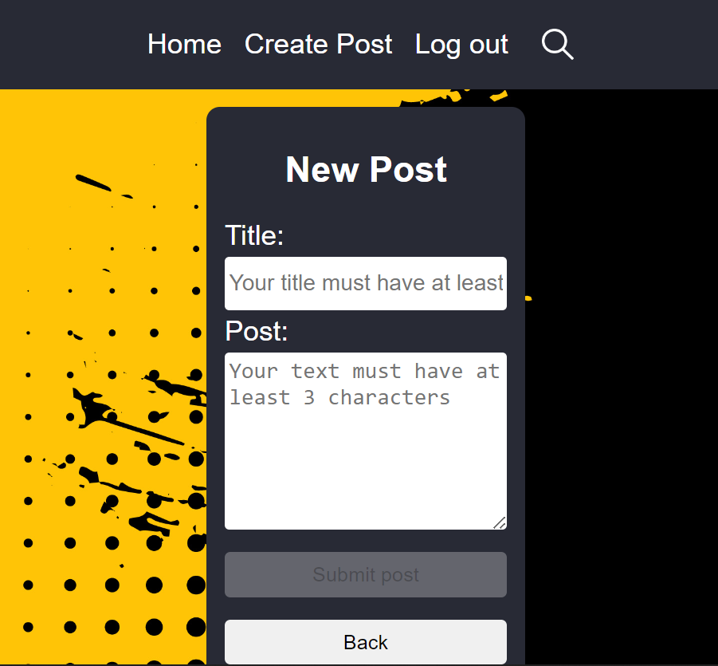
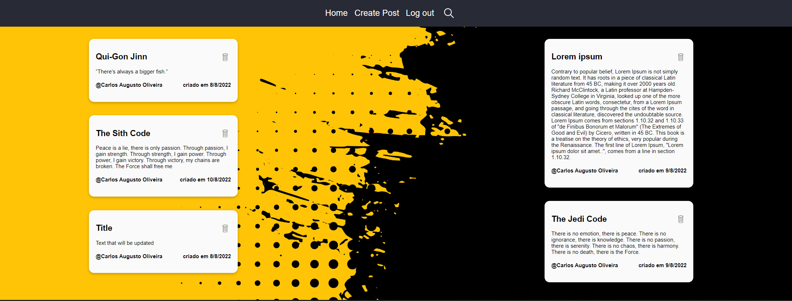
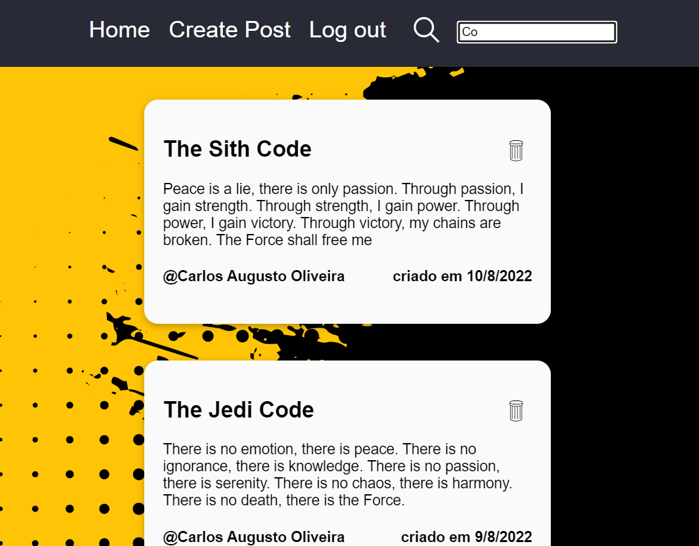

# Blog-like-Jounal-with-Firestore
A journal (which requires authentication) that will enable its users to Read, Create and Delete their posts, serving as a to-do list ou just as a blog respository.

## Table of contents

- [General view](#general-view)
  - [The Challenge](#the-challenge)
  - [Images](#images)
  - [Links](#links)
- [The development process](#the-development-process)
  - [Tools used](#tools-used)
  - [Lessons learned](#lessons-learned)
- [Usage](#usage)
- [Author](#author)

## General view

### The challenge

Blog-Journal is a project that the user is able to create, after sign in up, read and delete their posts. It's possible to sort them by its title.
**The users are capable of**

- log in and authenticate themselves through a Google account;
- create posts;
- sort posts by title;
- delete posts

## Images

<div align="center">
  
  
</div>

<div align="center">
  
  
</div>

## The development process

### Tools used

#### Front-end

- TypeScript
- React
- Axios
- Firebase Hosting
- CSS

#### Back-end

- TypeScript
- Node.js
- Express.js
- cors
- Firestore - Functions

### Lessons learned

In this project I could improve my knowledge in both front-end and back-end, by:

- Using and learning about new libraries and frameworks and its applicabilities.
- Using Firebase Functions to set the CRUD routes and Firestore to create and manage database.
- Fetching the backend using async actions.

## Usage

If you want to import this project into your local work:

```bash
git clone git@github.com:calopessoa/Blog-like-Jounal-with-Firestore.git
```
- To compile it, run:

```bash
npm run build
```
- To launch the application, run:

```bash
npm start
```
## Author

- LinkedIn - [Carlos Augusto Lopes de Oliveira](https://www.linkedin.com/in/carlos-augusto-lopes-de-oliveira-2602458b/)
